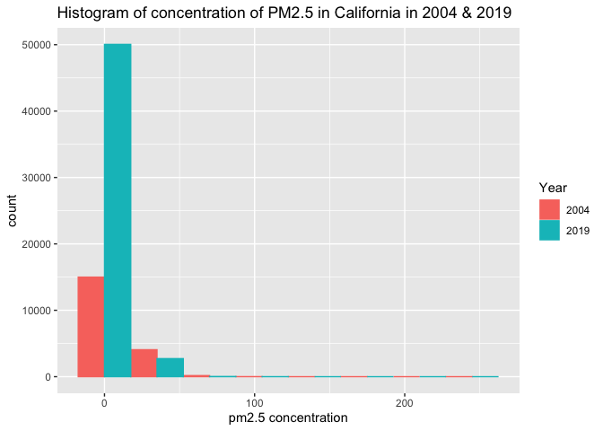

Assignment1
================
Jiayi Nie
24/09/2021

## 1.Read in the data using data.table().

For each of the two datasets, check the dimensions, headers, footers,
variable names and variable types. Check for any data issues,
particularly in the key variable we are analyzing. Make sure you write
up a summary of all of your findings.

``` r
pm2004 <- data.table::fread("2004.csv")
pm2019 <- data.table::fread("2019.csv")
```

``` r
dim(pm2004)
```

    ## [1] 19233    20

``` r
head(pm2004)
```

    ##          Date Source  Site ID POC Daily Mean PM2.5 Concentration    UNITS
    ## 1: 01/01/2004    AQS 60010007   1                            8.9 ug/m3 LC
    ## 2: 01/02/2004    AQS 60010007   1                           12.2 ug/m3 LC
    ## 3: 01/03/2004    AQS 60010007   1                           16.5 ug/m3 LC
    ## 4: 01/04/2004    AQS 60010007   1                           19.5 ug/m3 LC
    ## 5: 01/05/2004    AQS 60010007   1                           11.5 ug/m3 LC
    ## 6: 01/06/2004    AQS 60010007   1                           32.5 ug/m3 LC
    ##    DAILY_AQI_VALUE Site Name DAILY_OBS_COUNT PERCENT_COMPLETE
    ## 1:              37 Livermore               1              100
    ## 2:              51 Livermore               1              100
    ## 3:              60 Livermore               1              100
    ## 4:              67 Livermore               1              100
    ## 5:              48 Livermore               1              100
    ## 6:              94 Livermore               1              100
    ##    AQS_PARAMETER_CODE                     AQS_PARAMETER_DESC CBSA_CODE
    ## 1:              88101               PM2.5 - Local Conditions     41860
    ## 2:              88502 Acceptable PM2.5 AQI & Speciation Mass     41860
    ## 3:              88502 Acceptable PM2.5 AQI & Speciation Mass     41860
    ## 4:              88502 Acceptable PM2.5 AQI & Speciation Mass     41860
    ## 5:              88502 Acceptable PM2.5 AQI & Speciation Mass     41860
    ## 6:              88502 Acceptable PM2.5 AQI & Speciation Mass     41860
    ##                            CBSA_NAME STATE_CODE      STATE COUNTY_CODE  COUNTY
    ## 1: San Francisco-Oakland-Hayward, CA          6 California           1 Alameda
    ## 2: San Francisco-Oakland-Hayward, CA          6 California           1 Alameda
    ## 3: San Francisco-Oakland-Hayward, CA          6 California           1 Alameda
    ## 4: San Francisco-Oakland-Hayward, CA          6 California           1 Alameda
    ## 5: San Francisco-Oakland-Hayward, CA          6 California           1 Alameda
    ## 6: San Francisco-Oakland-Hayward, CA          6 California           1 Alameda
    ##    SITE_LATITUDE SITE_LONGITUDE
    ## 1:      37.68753      -121.7842
    ## 2:      37.68753      -121.7842
    ## 3:      37.68753      -121.7842
    ## 4:      37.68753      -121.7842
    ## 5:      37.68753      -121.7842
    ## 6:      37.68753      -121.7842

``` r
tail(pm2004)
```

    ##          Date Source  Site ID POC Daily Mean PM2.5 Concentration    UNITS
    ## 1: 12/14/2004    AQS 61131003   1                             11 ug/m3 LC
    ## 2: 12/17/2004    AQS 61131003   1                             16 ug/m3 LC
    ## 3: 12/20/2004    AQS 61131003   1                             17 ug/m3 LC
    ## 4: 12/23/2004    AQS 61131003   1                              9 ug/m3 LC
    ## 5: 12/26/2004    AQS 61131003   1                             24 ug/m3 LC
    ## 6: 12/29/2004    AQS 61131003   1                              9 ug/m3 LC
    ##    DAILY_AQI_VALUE            Site Name DAILY_OBS_COUNT PERCENT_COMPLETE
    ## 1:              46 Woodland-Gibson Road               1              100
    ## 2:              59 Woodland-Gibson Road               1              100
    ## 3:              61 Woodland-Gibson Road               1              100
    ## 4:              38 Woodland-Gibson Road               1              100
    ## 5:              76 Woodland-Gibson Road               1              100
    ## 6:              38 Woodland-Gibson Road               1              100
    ##    AQS_PARAMETER_CODE       AQS_PARAMETER_DESC CBSA_CODE
    ## 1:              88101 PM2.5 - Local Conditions     40900
    ## 2:              88101 PM2.5 - Local Conditions     40900
    ## 3:              88101 PM2.5 - Local Conditions     40900
    ## 4:              88101 PM2.5 - Local Conditions     40900
    ## 5:              88101 PM2.5 - Local Conditions     40900
    ## 6:              88101 PM2.5 - Local Conditions     40900
    ##                                  CBSA_NAME STATE_CODE      STATE COUNTY_CODE
    ## 1: Sacramento--Roseville--Arden-Arcade, CA          6 California         113
    ## 2: Sacramento--Roseville--Arden-Arcade, CA          6 California         113
    ## 3: Sacramento--Roseville--Arden-Arcade, CA          6 California         113
    ## 4: Sacramento--Roseville--Arden-Arcade, CA          6 California         113
    ## 5: Sacramento--Roseville--Arden-Arcade, CA          6 California         113
    ## 6: Sacramento--Roseville--Arden-Arcade, CA          6 California         113
    ##    COUNTY SITE_LATITUDE SITE_LONGITUDE
    ## 1:   Yolo      38.66121      -121.7327
    ## 2:   Yolo      38.66121      -121.7327
    ## 3:   Yolo      38.66121      -121.7327
    ## 4:   Yolo      38.66121      -121.7327
    ## 5:   Yolo      38.66121      -121.7327
    ## 6:   Yolo      38.66121      -121.7327

``` r
str(pm2004)
```

    ## Classes 'data.table' and 'data.frame':   19233 obs. of  20 variables:
    ##  $ Date                          : chr  "01/01/2004" "01/02/2004" "01/03/2004" "01/04/2004" ...
    ##  $ Source                        : chr  "AQS" "AQS" "AQS" "AQS" ...
    ##  $ Site ID                       : int  60010007 60010007 60010007 60010007 60010007 60010007 60010007 60010007 60010007 60010007 ...
    ##  $ POC                           : int  1 1 1 1 1 1 1 1 1 1 ...
    ##  $ Daily Mean PM2.5 Concentration: num  8.9 12.2 16.5 19.5 11.5 32.5 15.5 29.9 21 16.9 ...
    ##  $ UNITS                         : chr  "ug/m3 LC" "ug/m3 LC" "ug/m3 LC" "ug/m3 LC" ...
    ##  $ DAILY_AQI_VALUE               : int  37 51 60 67 48 94 58 88 70 61 ...
    ##  $ Site Name                     : chr  "Livermore" "Livermore" "Livermore" "Livermore" ...
    ##  $ DAILY_OBS_COUNT               : int  1 1 1 1 1 1 1 1 1 1 ...
    ##  $ PERCENT_COMPLETE              : num  100 100 100 100 100 100 100 100 100 100 ...
    ##  $ AQS_PARAMETER_CODE            : int  88101 88502 88502 88502 88502 88502 88502 88502 88502 88502 ...
    ##  $ AQS_PARAMETER_DESC            : chr  "PM2.5 - Local Conditions" "Acceptable PM2.5 AQI & Speciation Mass" "Acceptable PM2.5 AQI & Speciation Mass" "Acceptable PM2.5 AQI & Speciation Mass" ...
    ##  $ CBSA_CODE                     : int  41860 41860 41860 41860 41860 41860 41860 41860 41860 41860 ...
    ##  $ CBSA_NAME                     : chr  "San Francisco-Oakland-Hayward, CA" "San Francisco-Oakland-Hayward, CA" "San Francisco-Oakland-Hayward, CA" "San Francisco-Oakland-Hayward, CA" ...
    ##  $ STATE_CODE                    : int  6 6 6 6 6 6 6 6 6 6 ...
    ##  $ STATE                         : chr  "California" "California" "California" "California" ...
    ##  $ COUNTY_CODE                   : int  1 1 1 1 1 1 1 1 1 1 ...
    ##  $ COUNTY                        : chr  "Alameda" "Alameda" "Alameda" "Alameda" ...
    ##  $ SITE_LATITUDE                 : num  37.7 37.7 37.7 37.7 37.7 ...
    ##  $ SITE_LONGITUDE                : num  -122 -122 -122 -122 -122 ...
    ##  - attr(*, ".internal.selfref")=<externalptr>

``` r
names(pm2004)
```

    ##  [1] "Date"                           "Source"                        
    ##  [3] "Site ID"                        "POC"                           
    ##  [5] "Daily Mean PM2.5 Concentration" "UNITS"                         
    ##  [7] "DAILY_AQI_VALUE"                "Site Name"                     
    ##  [9] "DAILY_OBS_COUNT"                "PERCENT_COMPLETE"              
    ## [11] "AQS_PARAMETER_CODE"             "AQS_PARAMETER_DESC"            
    ## [13] "CBSA_CODE"                      "CBSA_NAME"                     
    ## [15] "STATE_CODE"                     "STATE"                         
    ## [17] "COUNTY_CODE"                    "COUNTY"                        
    ## [19] "SITE_LATITUDE"                  "SITE_LONGITUDE"

``` r
table(pm2004$`Daily Mean PM2.5 Concentration`)
```

    ## 
    ##  -0.1     0   0.1   0.2   0.3   0.4   0.5   0.6   0.7   0.8   0.9     1   1.1 
    ##     1    11    14    20    27    32    35    41    43    40    31    94    39 
    ##   1.2   1.3   1.4   1.5   1.6   1.7   1.8   1.9     2   2.1   2.2   2.3   2.4 
    ##    41    37    32    32    44    36    39    35   112    59    44    41    46 
    ##   2.5   2.6   2.7   2.8   2.9     3   3.1   3.2   3.3   3.4   3.5   3.6   3.7 
    ##    52    59    49    58    64   198    60    64    88    56    77    78    76 
    ##   3.8   3.9     4   4.1   4.2   4.3   4.4   4.5   4.6   4.7   4.8   4.9     5 
    ##    69    60   363    70    75    72    82    95    63    75    87    82   428 
    ##   5.1   5.2   5.3   5.4   5.5   5.6   5.7   5.8   5.9     6   6.1   6.2   6.3 
    ##    83    91    94    81   102    73    95    88   101   428    81    96    99 
    ##   6.4   6.5   6.6   6.7   6.8   6.9     7   7.1   7.2   7.3   7.4   7.5   7.6 
    ##    89   100    67    97    83    90   411    87   102    84    88   102    63 
    ##   7.7   7.8   7.9     8   8.1   8.2   8.3   8.4   8.5   8.6   8.7   8.8   8.9 
    ##   121   103    83   400    73   111    84    99   113    87    94    95    90 
    ##     9   9.1   9.2   9.3   9.4   9.5   9.6   9.7   9.8   9.9    10  10.1  10.2 
    ##   359    82   108    86    87    99    73   105    91    73   275    97   100 
    ##  10.3  10.4  10.5  10.6  10.7  10.8  10.9    11  11.1  11.2  11.3  11.4  11.5 
    ##    85    67   104    77    96    85    91   270    67    89    96    70    86 
    ##  11.6  11.7  11.8  11.9    12  12.1  12.2  12.3  12.4  12.5  12.6  12.7  12.8 
    ##    73    74    73    61   229    73    75    70    77    74    81    67    72 
    ##  12.9    13  13.1  13.2  13.3  13.4  13.5  13.6  13.7  13.8  13.9    14  14.1 
    ##    54   166    66    74    62    54    70    65    58    60    48   137    64 
    ##  14.2  14.3  14.4  14.5  14.6  14.7  14.8  14.9    15  15.1  15.2  15.3  15.4 
    ##    62    55    53    47    53    67    48    57   136    49    60    57    49 
    ##  15.5  15.6  15.7  15.8  15.9    16  16.1  16.2  16.3  16.4  16.5  16.6  16.7 
    ##    53    45    49    44    53   125    36    49    49    51    51    40    38 
    ##  16.8  16.9    17  17.1  17.2  17.3  17.4  17.5  17.6  17.7  17.8  17.9    18 
    ##    47    32    96    39    35    32    47    42    33    40    38    25    86 
    ##  18.1  18.2  18.3  18.4  18.5  18.6  18.7  18.8  18.9    19  19.1  19.2  19.3 
    ##    35    38    24    16    35    39    33    23    29    70    30    17    30 
    ##  19.4  19.5  19.6  19.7  19.8  19.9    20  20.1  20.2  20.3  20.4  20.5  20.6 
    ##    20    43    41    24    18    28    85    25    30    28    20    26    25 
    ##  20.7  20.8  20.9    21  21.1  21.2  21.3  21.4  21.5  21.6  21.7  21.8  21.9 
    ##    24    20    19    67    22    16    17    15    22    18    19    15    11 
    ##    22  22.1  22.2  22.3  22.4  22.5  22.6  22.7  22.8  22.9    23  23.1  23.2 
    ##    39    27    16    19    14    23    18    20    18    14    56    22    12 
    ##  23.3  23.4  23.5  23.6  23.7  23.8  23.9    24  24.1  24.2  24.3  24.4  24.5 
    ##    22    20    16    18    17    20    12    47    20    18    14     6    17 
    ##  24.6  24.7  24.8  24.9    25  25.1  25.2  25.3  25.4  25.5  25.6  25.7  25.8 
    ##    12    13    12    14    54    17    14    14    11    16    13    18     9 
    ##  25.9    26  26.1  26.2  26.3  26.4  26.5  26.6  26.7  26.8  26.9    27  27.1 
    ##    12    51    16     8    13    13    14    17     9     8    12    43    14 
    ##  27.2  27.3  27.4  27.5  27.6  27.7  27.8  27.9    28  28.1  28.2  28.3  28.4 
    ##    25     9     3    13     7     6    12     9    37    21    20    12    10 
    ##  28.5  28.6  28.7  28.8  28.9    29  29.1  29.2  29.3  29.4  29.5  29.6  29.7 
    ##    10    10     9     7    16    32    13    10    12     6    15    19    12 
    ##  29.8  29.9    30  30.1  30.2  30.3  30.4  30.5  30.6  30.7  30.8  30.9    31 
    ##    12    10    39    14    16    11     9    12    11    11     9     5    28 
    ##  31.1  31.2  31.3  31.4  31.5  31.6  31.7  31.8  31.9    32  32.1  32.2  32.3 
    ##     6    16     4    10     7     1     8    17    10    27     7    12    12 
    ##  32.4  32.5  32.6  32.7  32.8  32.9    33  33.1  33.2  33.3  33.4  33.5  33.6 
    ##     7    10     9     8    11    10    32     4     4    10    12    11     6 
    ##  33.7  33.8  33.9    34  34.1  34.2  34.3  34.4  34.5  34.6  34.7  34.8  34.9 
    ##    11     7     4    33     3     7     4    12     7     6     4     5     9 
    ##    35  35.1  35.2  35.3  35.4  35.5  35.6  35.7  35.8  35.9    36  36.1  36.2 
    ##    23     6    14     5     5     8     6     5     2     2    24     7     9 
    ##  36.3  36.4  36.5  36.6  36.7  36.8  36.9    37  37.1  37.2  37.3  37.4  37.5 
    ##     3     5     8     7     7     7     5    19     5     6     8    10     4 
    ##  37.6  37.7  37.8  37.9    38  38.1  38.2  38.3  38.4  38.5  38.6  38.7  38.8 
    ##     5     4     7     3    24     5     8     4     7     9     2     6     5 
    ##  38.9    39  39.1  39.2  39.3  39.4  39.5  39.6  39.7  39.8  39.9    40  40.1 
    ##     3    16     7     7     3     6     4     6     4     3     4     7     8 
    ##  40.2  40.3  40.4  40.5  40.6  40.7  40.8  40.9    41  41.1  41.2  41.3  41.4 
    ##     6     4     8    11     1     3     7     3    12     5     7     5     2 
    ##  41.5  41.6  41.7  41.8  41.9    42  42.1  42.2  42.3  42.4  42.5  42.6  42.7 
    ##     9     3     5     3     5    10     5     6     6     5     4     5     6 
    ##  42.9    43  43.1  43.2  43.3  43.4  43.5  43.6  43.7  43.8  43.9    44  44.1 
    ##     8    11     5     6     6     7     3     2     5     1     3    12     4 
    ##  44.2  44.3  44.4  44.5  44.6  44.7  44.8  44.9    45  45.1  45.2  45.3  45.4 
    ##     3     4     2     2     6     4     3     5     6     1     1     1     4 
    ##  45.5  45.7  45.8  45.9    46  46.1  46.2  46.3  46.4  46.5  46.6  46.7  46.8 
    ##     4     7     3     3     3     3     2     1     3     7     1     4     1 
    ##  46.9    47  47.1  47.2  47.3  47.5  47.6  47.7  47.8  47.9    48  48.1  48.2 
    ##     5     8     2     5     2     2     3     3     4     2     3     1     2 
    ##  48.3  48.4  48.5  48.6  48.7  48.9    49  49.2  49.3  49.4  49.5  49.6  49.7 
    ##     2     1     3     1     4     2     5     1     3     5     1     2     5 
    ##  49.9    50  50.1  50.2  50.4  50.5  50.6  50.8  50.9    51  51.2  51.4  51.5 
    ##     1     4     4     1     2     1     3     1     2     5     4     1     3 
    ##  51.7  51.8  51.9    52  52.1  52.2  52.4  52.5  52.7  52.8  52.9    53  53.1 
    ##     2     1     1     4     2     1     2     3     1     1     3     5     1 
    ##  53.2  53.3  53.5  53.7  53.8  53.9    54  54.2  54.3  54.4  54.6  54.8  54.9 
    ##     2     1     1     1     3     1     2     2     2     1     2     2     2 
    ##    55  55.1  55.2  55.3  55.5  55.6  55.7  55.8    56  56.1  56.2  56.3  56.4 
    ##     3     1     1     1     2     1     1     3     1     1     2     1     3 
    ##  56.8    57  57.2  57.3  57.4  57.9  58.1  58.4  58.7  58.9  59.1  59.2  59.3 
    ##     1     4     1     3     1     1     1     2     1     2     1     2     1 
    ##  59.4  59.5  59.7  59.9    60  60.1  60.3  60.4  60.5  60.7  60.8  60.9    61 
    ##     1     2     2     2     2     1     1     1     1     1     2     1     3 
    ##  61.2  61.5  61.7  61.8  62.5  62.6  62.7  63.1  63.4  63.9    64  64.9    65 
    ##     1     1     1     2     2     1     1     1     1     1     1     1     2 
    ##  65.3  65.4  66.1  66.3  66.6  67.1  67.3  67.4  68.2  68.6  68.7  68.9    69 
    ##     1     2     3     2     2     1     1     3     1     1     1     1     2 
    ##  69.3    70  70.6    71  71.4  72.4  72.8  73.6  73.7  74.2  74.5    75  75.6 
    ##     1     1     2     1     2     1     2     2     1     1     1     1     1 
    ##  76.8  77.1  77.5  79.8  80.9    81  81.4  81.6  81.9  82.3    83  86.1  90.2 
    ##     1     1     1     1     1     1     1     2     1     1     2     1     1 
    ##  90.7  90.9  91.7  93.4  93.8  95.7 100.4 102.1 110.4 122.5 148.4 170.4   251 
    ##     1     1     1     1     1     1     1     1     1     1     1     1     1

``` r
table(pm2004$DAILY_AQI_VALUE)
```

    ## 
    ##   0   1   2   3   4   5   6   7   8   9  10  11  12  13  14  15  16  17  18  19 
    ##  26  47  67 124 125 117  64  80 186 103 139 108 122 322 144 231 129 433 229 158 
    ##  20  21  22  23  24  25  26  27  28  29  30  31  32  33  34  35  36  37  38  39 
    ## 244 511 185 256 183 610 195 189 247 501 273 190 184 586 184 296 181 185 549 173 
    ##  40  41  42  43  44  45  46  47  48  49  50  51  52  53  54  55  56  57  58  59 
    ## 277 164 372 252 181 272 337 185 229 147 290 218 371 360 309 371 275 290 264 307 
    ##  60  61  62  63  64  65  66  67  68  69  70  71  72  73  74  75  76  77  78  79 
    ## 240 213 195 222 148 124 167 154 188  95 141  89 112  75 122  93 117  62  97  68 
    ##  80  81  82  83  84  85  86  87  88  89  90  91  92  93  94  95  96  97  98  99 
    ## 106  65  72  64  71  73  42  73  68  89  43  59  43  68  34  61  50  54  29  47 
    ## 100 101 102 103 104 105 106 107 108 109 110 111 112 113 114 115 116 117 118 119 
    ##  24  19  35  25  26  38  23  39  28  16  33  20  22  29  14  29  19  29  20  25 
    ## 120 121 122 123 124 125 126 127 128 129 130 131 132 133 134 135 136 137 138 139 
    ##  24  11  22  14  18   7  14  11  12  18   9  12   8   7  11  10   8   9   6   8 
    ## 140 141 142 143 144 145 146 147 148 149 150 151 152 153 154 155 156 157 158 159 
    ##   8   4   7   6  10   4   5   6   3   8   2  15  14  18  14   8   9   9   8   5 
    ## 160 161 162 164 165 167 169 170 171 172 174 175 179 186 199 221 301 
    ##   6   4   3   6   4   1   3   1   2   1   1   1   1   1   1   1   1

``` r
summary(pm2004$`Daily Mean PM2.5 Concentration`)
```

    ##    Min. 1st Qu.  Median    Mean 3rd Qu.    Max. 
    ##   -0.10    6.00   10.10   13.13   16.30  251.00

``` r
summary(pm2004$DAILY_AQI_VALUE)
```

    ##    Min. 1st Qu.  Median    Mean 3rd Qu.    Max. 
    ##    0.00   25.00   42.00   46.32   60.00  301.00

Summary: the max PM2.5 concentration is 251 with the median and IQR be
10.10 and 10.30 respectively, which means generally the air quanlity in
2004 is good, sometimes there might be serious pollution.

``` r
dim(pm2019)
```

    ## [1] 53086    20

``` r
head(pm2019)
```

    ##          Date Source  Site ID POC Daily Mean PM2.5 Concentration    UNITS
    ## 1: 01/01/2019    AQS 60010007   3                            5.7 ug/m3 LC
    ## 2: 01/02/2019    AQS 60010007   3                           11.9 ug/m3 LC
    ## 3: 01/03/2019    AQS 60010007   3                           20.1 ug/m3 LC
    ## 4: 01/04/2019    AQS 60010007   3                           28.8 ug/m3 LC
    ## 5: 01/05/2019    AQS 60010007   3                           11.2 ug/m3 LC
    ## 6: 01/06/2019    AQS 60010007   3                            2.7 ug/m3 LC
    ##    DAILY_AQI_VALUE Site Name DAILY_OBS_COUNT PERCENT_COMPLETE
    ## 1:              24 Livermore               1              100
    ## 2:              50 Livermore               1              100
    ## 3:              68 Livermore               1              100
    ## 4:              86 Livermore               1              100
    ## 5:              47 Livermore               1              100
    ## 6:              11 Livermore               1              100
    ##    AQS_PARAMETER_CODE       AQS_PARAMETER_DESC CBSA_CODE
    ## 1:              88101 PM2.5 - Local Conditions     41860
    ## 2:              88101 PM2.5 - Local Conditions     41860
    ## 3:              88101 PM2.5 - Local Conditions     41860
    ## 4:              88101 PM2.5 - Local Conditions     41860
    ## 5:              88101 PM2.5 - Local Conditions     41860
    ## 6:              88101 PM2.5 - Local Conditions     41860
    ##                            CBSA_NAME STATE_CODE      STATE COUNTY_CODE  COUNTY
    ## 1: San Francisco-Oakland-Hayward, CA          6 California           1 Alameda
    ## 2: San Francisco-Oakland-Hayward, CA          6 California           1 Alameda
    ## 3: San Francisco-Oakland-Hayward, CA          6 California           1 Alameda
    ## 4: San Francisco-Oakland-Hayward, CA          6 California           1 Alameda
    ## 5: San Francisco-Oakland-Hayward, CA          6 California           1 Alameda
    ## 6: San Francisco-Oakland-Hayward, CA          6 California           1 Alameda
    ##    SITE_LATITUDE SITE_LONGITUDE
    ## 1:      37.68753      -121.7842
    ## 2:      37.68753      -121.7842
    ## 3:      37.68753      -121.7842
    ## 4:      37.68753      -121.7842
    ## 5:      37.68753      -121.7842
    ## 6:      37.68753      -121.7842

``` r
tail(pm2019)
```

    ##          Date Source  Site ID POC Daily Mean PM2.5 Concentration    UNITS
    ## 1: 11/11/2019    AQS 61131003   1                           13.5 ug/m3 LC
    ## 2: 11/17/2019    AQS 61131003   1                           18.1 ug/m3 LC
    ## 3: 11/29/2019    AQS 61131003   1                           12.5 ug/m3 LC
    ## 4: 12/17/2019    AQS 61131003   1                           23.8 ug/m3 LC
    ## 5: 12/23/2019    AQS 61131003   1                            1.0 ug/m3 LC
    ## 6: 12/29/2019    AQS 61131003   1                            9.1 ug/m3 LC
    ##    DAILY_AQI_VALUE            Site Name DAILY_OBS_COUNT PERCENT_COMPLETE
    ## 1:              54 Woodland-Gibson Road               1              100
    ## 2:              64 Woodland-Gibson Road               1              100
    ## 3:              52 Woodland-Gibson Road               1              100
    ## 4:              76 Woodland-Gibson Road               1              100
    ## 5:               4 Woodland-Gibson Road               1              100
    ## 6:              38 Woodland-Gibson Road               1              100
    ##    AQS_PARAMETER_CODE       AQS_PARAMETER_DESC CBSA_CODE
    ## 1:              88101 PM2.5 - Local Conditions     40900
    ## 2:              88101 PM2.5 - Local Conditions     40900
    ## 3:              88101 PM2.5 - Local Conditions     40900
    ## 4:              88101 PM2.5 - Local Conditions     40900
    ## 5:              88101 PM2.5 - Local Conditions     40900
    ## 6:              88101 PM2.5 - Local Conditions     40900
    ##                                  CBSA_NAME STATE_CODE      STATE COUNTY_CODE
    ## 1: Sacramento--Roseville--Arden-Arcade, CA          6 California         113
    ## 2: Sacramento--Roseville--Arden-Arcade, CA          6 California         113
    ## 3: Sacramento--Roseville--Arden-Arcade, CA          6 California         113
    ## 4: Sacramento--Roseville--Arden-Arcade, CA          6 California         113
    ## 5: Sacramento--Roseville--Arden-Arcade, CA          6 California         113
    ## 6: Sacramento--Roseville--Arden-Arcade, CA          6 California         113
    ##    COUNTY SITE_LATITUDE SITE_LONGITUDE
    ## 1:   Yolo      38.66121      -121.7327
    ## 2:   Yolo      38.66121      -121.7327
    ## 3:   Yolo      38.66121      -121.7327
    ## 4:   Yolo      38.66121      -121.7327
    ## 5:   Yolo      38.66121      -121.7327
    ## 6:   Yolo      38.66121      -121.7327

``` r
str(pm2019)
```

    ## Classes 'data.table' and 'data.frame':   53086 obs. of  20 variables:
    ##  $ Date                          : chr  "01/01/2019" "01/02/2019" "01/03/2019" "01/04/2019" ...
    ##  $ Source                        : chr  "AQS" "AQS" "AQS" "AQS" ...
    ##  $ Site ID                       : int  60010007 60010007 60010007 60010007 60010007 60010007 60010007 60010007 60010007 60010007 ...
    ##  $ POC                           : int  3 3 3 3 3 3 3 3 3 3 ...
    ##  $ Daily Mean PM2.5 Concentration: num  5.7 11.9 20.1 28.8 11.2 2.7 2.8 7 3.1 7.1 ...
    ##  $ UNITS                         : chr  "ug/m3 LC" "ug/m3 LC" "ug/m3 LC" "ug/m3 LC" ...
    ##  $ DAILY_AQI_VALUE               : int  24 50 68 86 47 11 12 29 13 30 ...
    ##  $ Site Name                     : chr  "Livermore" "Livermore" "Livermore" "Livermore" ...
    ##  $ DAILY_OBS_COUNT               : int  1 1 1 1 1 1 1 1 1 1 ...
    ##  $ PERCENT_COMPLETE              : num  100 100 100 100 100 100 100 100 100 100 ...
    ##  $ AQS_PARAMETER_CODE            : int  88101 88101 88101 88101 88101 88101 88101 88101 88101 88101 ...
    ##  $ AQS_PARAMETER_DESC            : chr  "PM2.5 - Local Conditions" "PM2.5 - Local Conditions" "PM2.5 - Local Conditions" "PM2.5 - Local Conditions" ...
    ##  $ CBSA_CODE                     : int  41860 41860 41860 41860 41860 41860 41860 41860 41860 41860 ...
    ##  $ CBSA_NAME                     : chr  "San Francisco-Oakland-Hayward, CA" "San Francisco-Oakland-Hayward, CA" "San Francisco-Oakland-Hayward, CA" "San Francisco-Oakland-Hayward, CA" ...
    ##  $ STATE_CODE                    : int  6 6 6 6 6 6 6 6 6 6 ...
    ##  $ STATE                         : chr  "California" "California" "California" "California" ...
    ##  $ COUNTY_CODE                   : int  1 1 1 1 1 1 1 1 1 1 ...
    ##  $ COUNTY                        : chr  "Alameda" "Alameda" "Alameda" "Alameda" ...
    ##  $ SITE_LATITUDE                 : num  37.7 37.7 37.7 37.7 37.7 ...
    ##  $ SITE_LONGITUDE                : num  -122 -122 -122 -122 -122 ...
    ##  - attr(*, ".internal.selfref")=<externalptr>

``` r
names(pm2019)
```

    ##  [1] "Date"                           "Source"                        
    ##  [3] "Site ID"                        "POC"                           
    ##  [5] "Daily Mean PM2.5 Concentration" "UNITS"                         
    ##  [7] "DAILY_AQI_VALUE"                "Site Name"                     
    ##  [9] "DAILY_OBS_COUNT"                "PERCENT_COMPLETE"              
    ## [11] "AQS_PARAMETER_CODE"             "AQS_PARAMETER_DESC"            
    ## [13] "CBSA_CODE"                      "CBSA_NAME"                     
    ## [15] "STATE_CODE"                     "STATE"                         
    ## [17] "COUNTY_CODE"                    "COUNTY"                        
    ## [19] "SITE_LATITUDE"                  "SITE_LONGITUDE"

``` r
table(pm2019$`Daily Mean PM2.5 Concentration`)
```

    ## 
    ##  -2.2    -2  -1.9  -1.8  -1.7  -1.6  -1.5  -1.4  -1.3  -1.2  -1.1    -1  -0.9 
    ##     1    12    16    11    12    12     8    11    10    16     9    12    10 
    ##  -0.8  -0.7  -0.6  -0.5  -0.4  -0.3  -0.2  -0.1     0   0.1   0.2   0.3   0.4 
    ##    11    15     9    15    13    24    29    26    70    39    69    84    82 
    ##   0.5   0.6   0.7   0.8   0.9     1   1.1   1.2   1.3   1.4   1.5   1.6   1.7 
    ##   126   135   158   142   161   362   186   214   206   226   291   238   330 
    ##   1.8   1.9     2   2.1   2.2   2.3   2.4   2.5   2.6   2.7   2.8   2.9     3 
    ##   270   287   447   273   410   365   310   481   386   472   397   399   563 
    ##   3.1   3.2   3.3   3.4   3.5   3.6   3.7   3.8   3.9     4   4.1   4.2   4.3 
    ##   401   526   457   400   587   457   588   453   469   720   466   602   512 
    ##   4.4   4.5   4.6   4.7   4.8   4.9     5   5.1   5.2   5.3   5.4   5.5   5.6 
    ##   491   624   522   618   505   480   723   471   599   506   494   594   487 
    ##   5.7   5.8   5.9     6   6.1   6.2   6.3   6.4   6.5   6.6   6.7   6.8   6.9 
    ##   598   491   452   582   444   535   460   453   578   395   551   427   429 
    ##     7   7.1   7.2   7.3   7.4   7.5   7.6   7.7   7.8   7.9     8   8.1   8.2 
    ##   542   371   448   410   416   487   400   490   389   364   484   333   406 
    ##   8.3   8.4   8.5   8.6   8.7   8.8   8.9     9   9.1   9.2   9.3   9.4   9.5 
    ##   373   304   451   319   391   327   307   423   294   385   312   303   389 
    ##   9.6   9.7   9.8   9.9    10  10.1  10.2  10.3  10.4  10.5  10.6  10.7  10.8 
    ##   253   340   295   253   339   228   318   267   252   309   228   253   244 
    ##  10.9    11  11.1  11.2  11.3  11.4  11.5  11.6  11.7  11.8  11.9    12  12.1 
    ##   205   252   224   257   187   198   230   196   229   154   139   233   141 
    ##  12.2  12.3  12.4  12.5  12.6  12.7  12.8  12.9    13  13.1  13.2  13.3  13.4 
    ##   180   154   174   179   142   167   121   135   167   130   153   138   112 
    ##  13.5  13.6  13.7  13.8  13.9    14  14.1  14.2  14.3  14.4  14.5  14.6  14.7 
    ##   157   124   141   103   117   132    82   128    83   110   106    86   106 
    ##  14.8  14.9    15  15.1  15.2  15.3  15.4  15.5  15.6  15.7  15.8  15.9    16 
    ##    89    82   126    85   114    65    91    88    73    86    74    68    69 
    ##  16.1  16.2  16.3  16.4  16.5  16.6  16.7  16.8  16.9    17  17.1  17.2  17.3 
    ##    72    75    50    56    69    60    60    51    38    75    52    54    36 
    ##  17.4  17.5  17.6  17.7  17.8  17.9    18  18.1  18.2  18.3  18.4  18.5  18.6 
    ##    40    54    40    50    41    43    33    42    46    38    30    52    41 
    ##  18.7  18.8  18.9    19  19.1  19.2  19.3  19.4  19.5  19.6  19.7  19.8  19.9 
    ##    37    35    35    36    30    34    33    41    43    32    29    26    31 
    ##    20  20.1  20.2  20.3  20.4  20.5  20.6  20.7  20.8  20.9    21  21.1  21.2 
    ##    40    29    28    18    26    24    21    38    29    20    41    20    26 
    ##  21.3  21.4  21.5  21.6  21.7  21.8  21.9    22  22.1  22.2  22.3  22.4  22.5 
    ##    16    22    21    11    14    17    10    33    21    20    14    16    24 
    ##  22.6  22.7  22.8  22.9    23  23.1  23.2  23.3  23.4  23.5  23.6  23.7  23.8 
    ##    19    12    16    11    20    14    18    17    19    21    11     5    13 
    ##  23.9    24  24.1  24.2  24.3  24.4  24.5  24.6  24.7  24.8  24.9    25  25.1 
    ##    16    12    12    12    10     9    11    15    18    11    10    11    10 
    ##  25.2  25.3  25.4  25.5  25.6  25.7  25.8  25.9    26  26.1  26.2  26.3  26.4 
    ##     6     5    11    15     3    11    10     6    12     8     8    10     9 
    ##  26.5  26.6  26.7  26.8  26.9    27  27.1  27.2  27.3  27.4  27.5  27.6  27.7 
    ##    10     9    10     8     5    12     6    11     8    14     4     8     6 
    ##  27.8  27.9    28  28.1  28.2  28.3  28.4  28.5  28.6  28.7  28.8  28.9    29 
    ##     9     2    15     9    11     8     3     9     6    10     5     5     6 
    ##  29.1  29.2  29.3  29.4  29.5  29.6  29.7  29.8  29.9    30  30.1  30.2  30.3 
    ##     6     6     7     6     8    10    11     9     7    11     2     4     3 
    ##  30.4  30.5  30.6  30.7  30.8  30.9    31  31.1  31.2  31.3  31.4  31.5  31.6 
    ##     4    12    12     8     7    10     7     9    10     4     6     8     5 
    ##  31.7  31.8  31.9    32  32.1  32.2  32.3  32.4  32.5  32.6  32.7  32.8  32.9 
    ##     7     2     4     3     3     4     4     3     4     3     7     7     5 
    ##    33  33.1  33.2  33.3  33.4  33.5  33.6  33.7  33.8  33.9    34  34.1  34.2 
    ##     3     8     8     2     4     6     2     4     5     4     1     3     5 
    ##  34.3  34.4  34.5  34.6  34.7  34.8  34.9    35  35.1  35.2  35.3  35.4  35.5 
    ##     1     4     4     4     3     5     2     1     4     1     3     3     4 
    ##  35.6  35.7  35.8  35.9    36  36.1  36.2  36.3  36.4  36.7  36.8  36.9    37 
    ##     3     2     2     3     3     2     5     6     7     2     2     3     1 
    ##  37.1  37.2  37.3  37.4  37.5  37.6  37.7  37.8  37.9    38  38.1  38.3  38.4 
    ##     7     3     1     1     3     1     1     3     3     1     2     2     2 
    ##  38.5  38.6  38.7  38.9    39  39.1  39.2  39.3  39.4  39.5  39.6  39.7  39.8 
    ##     2     3     1     2     4     2     3     1     1     5     2     3     1 
    ##  39.9    40  40.1  40.2  40.3  40.4  40.5  40.6  40.7  40.9    41  41.1  41.2 
    ##     2     2     3     2     4     1     1     1     3     5     1     4     2 
    ##  41.3  41.4  41.5  41.6  41.7  41.8  41.9  42.2  42.3  42.8  43.1  43.3  43.4 
    ##     2     3     1     2     1     1     1     1     1     1     2     1     3 
    ##  43.5  43.6    44  44.2  44.3  44.4  44.5  44.7  44.8  45.1  45.3  45.4  45.5 
    ##     1     1     1     2     2     1     1     1     1     1     1     1     1 
    ##  45.7  45.8    46  46.3  46.4  46.5  46.7  47.1  47.2  47.4  47.5  47.9    48 
    ##     1     1     1     1     4     1     3     3     1     1     1     1     1 
    ##  48.1  48.2  48.8    49  49.3  49.4  49.6  50.1  50.2  50.6  50.7  50.9  51.3 
    ##     1     1     1     1     1     2     1     1     1     2     2     2     1 
    ##  52.3  52.4    53  53.1  54.7  55.7    57  57.6  57.7  58.2  58.8  59.1  60.4 
    ##     1     1     2     2     1     1     1     2     1     1     1     1     1 
    ##  60.5  62.2  62.6  63.4  66.1  68.4  68.5  70.1  70.3  71.2  73.9  75.1  77.3 
    ##     1     1     1     1     1     1     1     1     1     1     1     1     1 
    ##  77.4  81.3  83.7  91.1  97.3  98.9 103.5 104.5 120.9 
    ##     1     1     1     1     1     1     1     1     1

``` r
table(pm2019$DAILY_AQI_VALUE)
```

    ## 
    ##    0    1    2    3    4    5    6    7    8    9   10   11   12   13   14   15 
    ##  391  153  208  435  523  606  517  568 1004  683 1156  858  796 1490  857 1632 
    ##   16   17   18   19   20   21   22   23   24   25   26   27   28   29   30   31 
    ##  922 1186 1605 1146 1603 1194 1105 1575 1089 1478  995 1031 1373  971 1229  903 
    ##   32   33   34   35   36   37   38   39   40   41   42   43   44   45   46   47 
    ##  890 1237  739 1128  710  634 1102  615  982  548  567  837  537  702  476  444 
    ##   48   49   50   51   52   53   54   55   56   57   58   59   60   61   62   63 
    ##  624  383  372  475  783  585  672  562  491  382  431  369  310  224  236  207 
    ##   64   65   66   67   68   69   70   71   72   73   74   75   76   77   78   79 
    ##  208  148  174  161  141  112  123   85   98   71   79   73   65   63   42   40 
    ##   80   81   82   83   84   85   86   87   88   89   90   91   92   93   94   95 
    ##   47   46   35   43   40   40   26   31   45   24   39   40   28   18   17   31 
    ##   96   97   98   99  100  101  102  103  104  105  106  107  108  109  110  111 
    ##   18   18   13   15    7    9   10   18    7   12    6    9    6    6   10   11 
    ##  112  113  114  115  116  117  118  119  120  121  122  123  124  125  126  127 
    ##    8    8    9    9    7    3    1    1    6    2    3    4    2    3    3    1 
    ##  128  129  130  131  132  134  135  136  137  138  139  140  142  143  144  148 
    ##    6    3    5    1    4    2    3    1    2    4    2    1    1    1    4    1 
    ##  151  152  153  154  155  156  158  159  161  162  164  166  169  173  176  185 
    ##    1    5    2    3    2    1    2    3    2    2    1    1    1    2    2    1

``` r
summary(pm2019$`Daily Mean PM2.5 Concentration`)
```

    ##    Min. 1st Qu.  Median    Mean 3rd Qu.    Max. 
    ##  -2.200   4.000   6.500   7.734   9.900 120.900

``` r
summary(pm2019$DAILY_AQI_VALUE)
```

    ##    Min. 1st Qu.  Median    Mean 3rd Qu.    Max. 
    ##    0.00   17.00   27.00   30.56   41.00  185.00

Summary: the max pm2.5 is decrease to 120.9, compared to 2004. The
median is 6.5 and the IQR is 5.9 which mean more centered and healthier.

## 2.Combine the two years of data into one data frame. Use the Date variable to create a new column for year, which will serve as an identifier. Change the names of the key variables so that they are easier to refer to in your code.

``` r
pm2019[,Year:= 2019]
pm2004[,Year:= 2004]
pm0419 <- rbind(pm2004,pm2019,fill=TRUE)
str(pm0419)
```

    ## Classes 'data.table' and 'data.frame':   72319 obs. of  21 variables:
    ##  $ Date                          : chr  "01/01/2004" "01/02/2004" "01/03/2004" "01/04/2004" ...
    ##  $ Source                        : chr  "AQS" "AQS" "AQS" "AQS" ...
    ##  $ Site ID                       : int  60010007 60010007 60010007 60010007 60010007 60010007 60010007 60010007 60010007 60010007 ...
    ##  $ POC                           : int  1 1 1 1 1 1 1 1 1 1 ...
    ##  $ Daily Mean PM2.5 Concentration: num  8.9 12.2 16.5 19.5 11.5 32.5 15.5 29.9 21 16.9 ...
    ##  $ UNITS                         : chr  "ug/m3 LC" "ug/m3 LC" "ug/m3 LC" "ug/m3 LC" ...
    ##  $ DAILY_AQI_VALUE               : int  37 51 60 67 48 94 58 88 70 61 ...
    ##  $ Site Name                     : chr  "Livermore" "Livermore" "Livermore" "Livermore" ...
    ##  $ DAILY_OBS_COUNT               : int  1 1 1 1 1 1 1 1 1 1 ...
    ##  $ PERCENT_COMPLETE              : num  100 100 100 100 100 100 100 100 100 100 ...
    ##  $ AQS_PARAMETER_CODE            : int  88101 88502 88502 88502 88502 88502 88502 88502 88502 88502 ...
    ##  $ AQS_PARAMETER_DESC            : chr  "PM2.5 - Local Conditions" "Acceptable PM2.5 AQI & Speciation Mass" "Acceptable PM2.5 AQI & Speciation Mass" "Acceptable PM2.5 AQI & Speciation Mass" ...
    ##  $ CBSA_CODE                     : int  41860 41860 41860 41860 41860 41860 41860 41860 41860 41860 ...
    ##  $ CBSA_NAME                     : chr  "San Francisco-Oakland-Hayward, CA" "San Francisco-Oakland-Hayward, CA" "San Francisco-Oakland-Hayward, CA" "San Francisco-Oakland-Hayward, CA" ...
    ##  $ STATE_CODE                    : int  6 6 6 6 6 6 6 6 6 6 ...
    ##  $ STATE                         : chr  "California" "California" "California" "California" ...
    ##  $ COUNTY_CODE                   : int  1 1 1 1 1 1 1 1 1 1 ...
    ##  $ COUNTY                        : chr  "Alameda" "Alameda" "Alameda" "Alameda" ...
    ##  $ SITE_LATITUDE                 : num  37.7 37.7 37.7 37.7 37.7 ...
    ##  $ SITE_LONGITUDE                : num  -122 -122 -122 -122 -122 ...
    ##  $ Year                          : num  2004 2004 2004 2004 2004 ...
    ##  - attr(*, ".internal.selfref")=<externalptr>

``` r
colnames(pm0419)[5] <- "Cpm2.5"
colnames(pm0419)[7] <- "AQI"
colnames(pm0419)[19] <- "lat"
colnames(pm0419)[20] <- "lon"
```

## 3.Create a basic map in leaflet() that shows the locations of the sites (make sure to use different colors for each year). Summarize the spatial distribution of the monitoring sites.

``` r
loc.pal <- colorNumeric(c("dodgerblue3","darkorange2"),domain=pm0419$Year)

leaflet(pm0419) %>% 
  addProviderTiles('CartoDB.Positron') %>%
  addCircles(
    lat = ~lat, lng=~lon,
    color = ~ loc.pal(pm0419$Year),
    opacity =1, fillOpacity=1, radius=300
  )  %>%
  addLegend('bottomright',pal=loc.pal, values=pm0419$Year,
            title='Year',opacity = 1)
```

## 4.Check for any missing or implausible values of PM in the combined dataset. Explore the proportions of each and provide a summary of any temporal patterns you see in these observations.

``` r
summary(pm0419$Cpm2.5)
```

    ##    Min. 1st Qu.  Median    Mean 3rd Qu.    Max. 
    ##  -2.200   4.400   7.200   9.168  11.300 251.000

``` r
# there should not be negative value
mean(pm0419$Cpm2.5<0)
```

    ## [1] 0.003913218

``` r
pm0419 <- pm0419[Cpm2.5>=0]
summary(pm0419$Cpm2.5)
```

    ##    Min. 1st Qu.  Median    Mean 3rd Qu.    Max. 
    ##   0.000   4.400   7.300   9.207  11.300 251.000

There is 0.39% negative value in the combined dataset. Question: How
does the mean() function works for us to get the proportion? I write
this line according to lecture 3 but I don’t really understand why
mean() can help us get the proportion. Could you please explain the
mechanism of this line? Thank you\!

## 5.Explore the main question of interest at three different spatial levels. Create exploratory plots (e.g. boxplots, histograms, line plots) and summary statistics that best suit each level of data. Be sure to write up explanations of what you observe in these data.

``` r
pm0419$Year<-as.character(pm0419$Year)
ggplot(pm0419)+
  geom_histogram(mapping=aes(x=Cpm2.5,fill=Year,color=Year),binwidth = 35, position="dodge")+
  labs(title = "Histogram of concentration of PM2.5 in California in 2004 & 2019",x="pm2.5 concentration")
```

<!-- -->

``` r
ggplot(pm0419)+
  geom_boxplot(mapping=aes(y=Cpm2.5,x=Year,color=Year))+
  ylim(0,150)+
  facet_wrap(~COUNTY)
```

    ## Warning: Removed 2 rows containing non-finite values (stat_boxplot).


``` r
LA <- pm0419 %>%
  filter(COUNTY == "Los Angeles")
colnames(LA)[8] <- "Site"
LA$Site[LA$Site ==""] <- "Unknown site"
ggplot(LA)+
  geom_point(mapping=aes(x=Site,y=Cpm2.5,color=Year))+
  theme(axis.text.x = element_text(size=6,angle=30))
```

<!-- -->

Summary: Genrally speaking, the air quality in year 2019 is much better
than year 2004, with more observation data and more centered at lower
pm2.5 concentration level.
