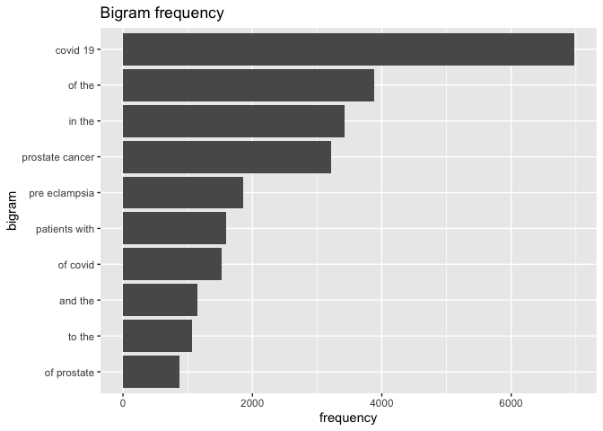

Assignment3
================
Jiayi Nie
11/03/2021

``` r
library(tidyverse)
```

    ## ── Attaching packages ────────────────────────────────────── tidyverse 1.3.1 ──

    ## ✓ ggplot2 3.3.5     ✓ purrr   0.3.4
    ## ✓ tibble  3.1.3     ✓ dplyr   1.0.7
    ## ✓ tidyr   1.1.3     ✓ stringr 1.4.0
    ## ✓ readr   2.0.1     ✓ forcats 0.5.1

    ## ── Conflicts ───────────────────────────────────────── tidyverse_conflicts() ──
    ## x dplyr::filter() masks stats::filter()
    ## x dplyr::lag()    masks stats::lag()

``` r
library(tidytext)
library(data.table)
```

    ## 
    ## Attaching package: 'data.table'

    ## The following objects are masked from 'package:dplyr':
    ## 
    ##     between, first, last

    ## The following object is masked from 'package:purrr':
    ## 
    ##     transpose

``` r
library(stringr)
library(forcats)
```

# APIs

## How many papers were able to find

``` r
# Downloading the website
web <- xml2::read_html("https://pubmed.ncbi.nlm.nih.gov/?term=sars-cov-2+trial+vaccine+children.")

# Finding the counts
counts1 <- xml2::xml_find_first(web, "/html/body/main/div[9]/div[2]/div[2]/div[1]/div[1]")

# Turning it into text
counts1 <- as.character(counts1)

# Extracting the data using regex
stringr::str_extract(counts1, "[0-9,]+")
```

    ## [1] "266"

``` r
library(httr)
query_ids <- GET(
  url   = "https://eutils.ncbi.nlm.nih.gov/entrez/eutils/esearch.fcgi",
  query = list(
    db = "pubmed",
    term = "sars-cov-2 trial vaccine children",
    retmax = 250
    )
)

# Extracting the content of the response of GET
ids <- httr::content(query_ids)
```

``` r
# Turn the result into a character vector
ids <- as.character(ids)

# Find all the ids 
ids <- stringr::str_extract_all(ids, "<Id>[[:digit:]]+</Id>")[[1]]

# Remove all the leading and trailing <Id> </Id>. Make use of "|"
ids <- stringr::str_remove_all(ids, "<Id>|</Id>")

publications <- GET(
  url   = "https://eutils.ncbi.nlm.nih.gov/",
  path  = "entrez/eutils/efetch.fcgi",
  query = list(
    db = "pubmed",
    id = I(paste(ids, collapse=",")),
    retmax = 250,
    rettype = "abstract"
    )
)

# Turning the output into character vector
publications <- httr::content(publications)
publications_txt <- as.character(publications)
```

\#\#Form the dataset

keep one element per id

``` r
pub_char_list <- xml2::xml_children(publications)
pub_char_list <- sapply(pub_char_list, as.character)
```

Geitting the abstracts

``` r
abstracts <- str_extract(pub_char_list, "<Abstract>[[:print:][:space:]]+</Abstract>")
abstracts <- str_remove_all(abstracts, "</?[[:alnum:]- =\"]+>") # '</?[[:alnum:]- ="]+>'
abstracts <- str_replace_all(abstracts, "[[:space:]]+", " ")
```

Getting the titles

``` r
titles <- str_extract(pub_char_list, "<ArticleTitle>[[:print:][:space:]]+</ArticleTitle>")
titles <- str_remove_all(titles, "</?[[:alnum:]- =\"]+>")
```

Getting the publication date

``` r
pubdate <- str_extract(pub_char_list, "<PubDate>[[:print:][:space:]]+</PubDate>")
pubdate <- str_remove_all(pubdate, "</?[[:alnum:]- =\"]+>")
pubdate <- str_replace_all(pubdate, "[[:space:]]+", " ")
```

Getting the publication journal

``` r
journal <- str_extract(pub_char_list, "<Title>[[:print:][:space:]]+</Title>")
journal <- str_remove_all(journal, "</?[[:alnum:]- =\"]+>")
```

Finally, the dataset

``` r
database <- data.frame(
  PubMedId = ids,
  Title    = titles,
  Journal  = journal,
  Date     = pubdate,
  Abstract = abstracts
)
knitr::kable(database[1:10,], caption = "Some papers about 'sars-cov-2 trial vaccine children' ")
```

| PubMedId | Title                                                                                                                                                                                                                                        | Journal                                                                                                                | Date         | Abstract                                                                                                                                                                                                                                                                                                                                                                                                                                                                                                                                                                                                                                                                                                                                                                                                                                                                                                                                                                                                                                                                                                                                                                                                                                                                                                                                                                                                                                                                                                                                                                                                                                                                                                                                                                                                                                                                                                                                                                                                                                                                                                                                                                                                                                                                                                                                                                                                                                                                                                                                                                                                                                                                                                                                                                                                                                                                                                                                                                                                                                                                                                                                                                                                                                                                                                                                                                                                                                                                                                                                                                                                                                                                                                                                                                                                                                                                                                                                                                                                                                                                                                                                                                                                                                                                                |
| :------- | :------------------------------------------------------------------------------------------------------------------------------------------------------------------------------------------------------------------------------------------- | :--------------------------------------------------------------------------------------------------------------------- | :----------- | :-------------------------------------------------------------------------------------------------------------------------------------------------------------------------------------------------------------------------------------------------------------------------------------------------------------------------------------------------------------------------------------------------------------------------------------------------------------------------------------------------------------------------------------------------------------------------------------------------------------------------------------------------------------------------------------------------------------------------------------------------------------------------------------------------------------------------------------------------------------------------------------------------------------------------------------------------------------------------------------------------------------------------------------------------------------------------------------------------------------------------------------------------------------------------------------------------------------------------------------------------------------------------------------------------------------------------------------------------------------------------------------------------------------------------------------------------------------------------------------------------------------------------------------------------------------------------------------------------------------------------------------------------------------------------------------------------------------------------------------------------------------------------------------------------------------------------------------------------------------------------------------------------------------------------------------------------------------------------------------------------------------------------------------------------------------------------------------------------------------------------------------------------------------------------------------------------------------------------------------------------------------------------------------------------------------------------------------------------------------------------------------------------------------------------------------------------------------------------------------------------------------------------------------------------------------------------------------------------------------------------------------------------------------------------------------------------------------------------------------------------------------------------------------------------------------------------------------------------------------------------------------------------------------------------------------------------------------------------------------------------------------------------------------------------------------------------------------------------------------------------------------------------------------------------------------------------------------------------------------------------------------------------------------------------------------------------------------------------------------------------------------------------------------------------------------------------------------------------------------------------------------------------------------------------------------------------------------------------------------------------------------------------------------------------------------------------------------------------------------------------------------------------------------------------------------------------------------------------------------------------------------------------------------------------------------------------------------------------------------------------------------------------------------------------------------------------------------------------------------------------------------------------------------------------------------------------------------------------------------------------------------------------------------- |
| 34689329 | Clinical care of children and adolescents with COVID-19: recommendations from the National COVID-19 Clinical Evidence Taskforce.                                                                                                             | The Medical journal of Australia                                                                                       | 2021 Oct 24  | The epidemiology and clinical manifestations of severe acute respiratory syndrome coronavirus 2 (SARS-CoV-2) infection are different in children and adolescents compared with adults. Although coronavirus disease 2019 (COVID-19) appears to be less common in children, with milder disease overall, severe complications may occur, including paediatric inflammatory multisystem syndrome (PIMS-TS). Recognising the distinct needs of this population, the National COVID-19 Clinical Evidence Taskforce formed a Paediatric and Adolescent Care Panel to provide living guidelines for Australian clinicians to manage children and adolescents with COVID-19 and COVID-19 complications. Living guidelines mean that these evidence-based recommendations are updated in near real time to give reliable, contemporaneous advice to Australian clinicians providing paediatric care. To date, the Taskforce has made 20 specific recommendations for children and adolescents, including definitions of disease severity, recommendations for therapy, respiratory support, and venous thromboembolism prophylaxis for COVID-19 and for the management of PIMS-TS. The Taskforce currently recommends corticosteroids as first line treatment for acute COVID-19 in children and adolescents who require oxygen. Tocilizumab could be considered, and remdesivir should not be administered routinely in this population. Non-invasive ventilation or high flow nasal cannulae should be considered in children and adolescents with hypoxaemia or respiratory distress unresponsive to low flow oxygen if appropriate infection control measures can be used. Children and adolescents with PIMS-TS should be managed by a multidisciplinary team. Intravenous immunoglobulin and corticosteroids, with concomitant aspirin and thromboprophylaxis, should be considered for the treatment of PIMS-TS. The latest updates and full recommendations are available at www.covid19evidence.net.au. © 2021 AMPCo Pty Ltd.                                                                                                                                                                                                                                                                                                                                                                                                                                                                                                                                                                                                                                                                                                                                                                                                                                                                                                                                                                                                                                                                                                                                                                                                                                                                                                                                                                                                                                                                                                                                                                                                                                                                                                                                                                                                                                                                                                                                                                                                                                                                                                                                                                                                                                                          |
| 34656181 | Anaphylactic and nonanaphylactic reactions to SARS-CoV-2 vaccines: a systematic review and meta-analysis.                                                                                                                                    | Allergy, asthma, and clinical immunology : official journal of the Canadian Society of Allergy and Clinical Immunology | 2021 Oct 16  | Currently there is no systematic review and meta-analysis of the global incidence rates of anaphylactic and nonanaphylactic reactions to SARS-CoV-2 vaccines in the general adult population. To estimate the incidence rates of anaphylactic and nonanaphylactic reactions after COVID-19 vaccines and describe the demographic and clinical characteristics, triggers, presenting signs and symptoms, treatment and clinical course of confirmed cases. A systematic review and meta-analysis. Preferred Reporting Items for Systematic Reviews and Meta-Analyses \[PRISMA\] statement was followed. Electronic databases (Proquest, Medline, Embase, Pubmed, CINAHL, Wiley online library, and Nature) were searched from 1 December 2020 to 31 May 2021 in the English language using the following keywords alone or in combination: anaphylaxis, non-anaphylaxis, anaphylactic reaction, nonanaphylactic reaction, anaphylactic/anaphylactoid shock, hypersensitivity, allergy reaction, allergic reaction, immunology reaction, immunologic reaction, angioedema, loss of consciousness, generalized erythema, urticaria, urticarial rash, cyanosis, grunting, stridor, tachypnoea, wheezing, tachycardia, abdominal pain, diarrhea, nausea, vomiting and tryptase. We included studies in adults of all ages in all healthcare settings. Effect sizes of prevalence were pooled with 95% confidence intervals (CIs). To minimize heterogeneity, we performed sub-group analyses. Of the 1,734 papers that were identified, 26 articles were included in the systematic review (8 case report, 5 cohort, 4 case series, 2 randomized controlled trial and 1 randomized cross-sectional studies) and 14 articles (1 cohort, 2 case series, 1 randomized controlled trial and 1 randomized cross-sectional studies) were included in meta-analysis. Studies involving 26,337,421 vaccine recipients \[Pfizer-BioNTech (n = 14,505,399) and Moderna (n = 11,831,488)\] were analyzed. The overall pooled prevalence estimate of anaphylaxis to both vaccines was 5.0 (95% CI 2.9 to 7.2, I2 = 81%, p = \< 0.0001), while the overall pooled prevalence estimate of nonanaphylactic reactions to both vaccines was 53.9 (95% CI 0.0 to 116.1, I2 = 99%, p = \< 0.0001). Vaccination with Pfizer-BioNTech resulted in higher anaphylactic reactions compared to Moderna (8.0, 95% CI 0.0 to 11.3, I2 = 85% versus 2.8, 95% CI 0.0 to 5.7, I2 = 59%). However, lower incidence of nonanaphylactic reactions was associated with Pfizer-BioNTech compared to Moderna (43.9, 95% CI 0.0 to 131.9, I2 = 99% versus 63.8, 95% CI 0.0 to 151.8, I2 = 98%). The funnel plots for possible publication bias for the pooled effect sizes to determine the incidence of anaphylaxis and nonanaphylactic reactions associated with mRNA COVID-19 immunization based on mRNA vaccine type appeared asymmetrical on visual inspection, and Egger’s tests confirmed asymmetry by producing p values \< 0.05. Across the included studies, the most commonly identified risk factors for anaphylactic and nonanaphylactic reactions to SARS-CoV-2 vaccines were female sex and personal history of atopy. The key triggers to anaphylactic and nonanaphylactic reactions identified in these studies included foods, medications, stinging insects or jellyfish, contrast media, cosmetics and detergents, household products, and latex. Previous history of anaphylaxis; and comorbidities such as asthma, allergic rhinitis, atopic and contact eczema/dermatitis and psoriasis and cholinergic urticaria were also found to be important. The prevalence of COVID-19 mRNA vaccine-associated anaphylaxis is very low; and nonanaphylactic reactions occur at higher rate, however, cutaneous reactions are largely self-limited. Both anaphylactic and nonanaphylactic reactions should not discourage vaccination. © 2021. The Author(s).                                                                                                                                                                                                                                                                                                                                                       |
| 34655522 | Safety and immunogenicity of CpG 1018 and aluminium hydroxide-adjuvanted SARS-CoV-2 S-2P protein vaccine MVC-COV1901: interim results of a large-scale, double-blind, randomised, placebo-controlled phase 2 trial in Taiwan.                | The Lancet. Respiratory medicine                                                                                       | 2021 Oct 13  | MVC-COV1901, a recombinant protein vaccine containing pre-fusion-stabilised spike protein S-2P adjuvanted with CpG 1018 and aluminium hydroxide, has been shown to be well tolerated with a good safety profile in healthy adults aged 20-49 years in a phase 1 trial, and provided a good cellular and humoral immune responses. We present the interim safety, tolerability, and immunogenicity results of a phase 2 clinical trial of the MVC-COV1901 vaccine in Taiwan. This is a large-scale, double-blind, randomised, placebo-controlled phase 2 trial done at ten medical centres and one regional hospital in Taiwan. Individuals aged 20 years or older who were generally healthy or had stable pre-existing medical conditions were eligible for enrolment. Exclusion criteria included (but were not limited to) travel overseas within 14 days of screening, intention to travel overseas within 6 months of the screening visit, and the absence of prespecified medical conditions, including immunosuppressive illness, a history of autoimmune disease, malignancy with risk to recur, a bleeding disorder, uncontrolled HIV infection, uncontrolled hepatitis B and C virus infections, SARS-CoV-1 or SARS-CoV-2 infections, an allergy to any vaccine, or a serious medical condition that could interfere with the study. Study participants were randomly assigned (6:1) to receive two doses of either MVC-COV1901 or placebo, administered via intramuscular injection on day 1 and day 29. MVC-COV1901 contained 15 μg of S-2P protein adjuvanted with 750 μg CpG 1018 and 375 μg aluminium hydroxide in a 0·5 mL aqueous solution, and the placebo contained the same volume of saline. Randomisation was done centrally by use of an interactive web response system, stratified by age (≥20 to \<65 years and ≥65 years). Participants and investigators were masked to group assignment. The primary outcomes were to evaluate the safety, tolerability, and immunogenicity of MVC-COV1901 from day 1 (the day of the first dose) to day 57 (28 days after the second dose). Safety was assessed in all participants who received at least one dose. Immunogenicity was assessed by measuring geometric mean titres (GMTs) and seroconversion rates of neutralising antibody and antigen-specific IgG in the per-protocol population. This study is registered with ClinicalTrials.gov, NCT04695652. Of 4173 individuals screened between Dec 30, 2020, and April 2, 2021, 3854 were enrolled and randomly assigned: 3304 to the MVC-COV1901 group and 550 to the placebo group. A total of 3844 participants (3295 in the MVC-COV1901 group and 549 in the placebo group) were included in the safety analysis set, and 1053 participants (903 and 150) had received both doses and were included in the per-protocol immunogenicity analysis set. From the start of this phase 2 trial to the time of interim analysis, no vaccine-related serious adverse events were recorded. The most common solicited adverse events in all study participants were pain at the injection site (2346 \[71·2%\] of 3295 in the MVC-COV1901 group and 128 \[23·3%\] of 549 in the placebo group), and malaise or fatigue (1186 \[36·0%\] and 163 \[29·7%\]). Fever was rarely reported (23 \[0·7%\] and two \[0·4%\]). At 28 days after the second dose of MVC-COV1901, the wild-type SARS-CoV-2 neutralising antibody GMT was 662·3 (95% CI 628·7-697·8; 408·5 IU/mL), the GMT ratio (geometric mean fold increase in titres at day 57 vs baseline) was 163·2 (155·0-171·9), and the seroconversion rate was 99·8% (95% CI 99·2-100·0). MVC-COV1901 has a good safety profile and elicits promising immunogenicity responses. These data support MVC-COV1901 to enter phase 3 efficacy trials. Medigen Vaccine Biologics and Taiwan Centres for Disease Control, Ministry of Health and Welfare. Copyright © 2021 Elsevier Ltd. All rights reserved.                                                                                                                                                                                                                                                                                                                 |
| 34642255 | SARS-CoV-2 antibodies in Ontario health care workers during and after the first wave of the pandemic: a cohort study.                                                                                                                        | CMAJ open                                                                                                              | 2021 Oct-Dec | Health care workers have a critical role in the pandemic response to COVID-19 and may be at increased risk of infection. The objective of this study was to assess the seroprevalence of SARS-CoV-2 immunoglobulin G (IgG) antibodies among health care workers during and after the first wave of the pandemic. We conducted a prospective multicentre cohort study involving health care workers in Ontario, Canada, to detect IgG antibodies against SARS-CoV-2. Blood samples and self-reported questionnaires were obtained at enrolment, at 6 weeks and at 12 weeks. A community hospital, tertiary care pediatric hospital and a combined adult-pediatric academic health centre enrolled participants from Apr. 1 to Nov. 13, 2020. Predictors of seropositivity were evaluated using a multivariable logistic regression, adjusted for clustering by hospital site. Among the 1062 health care workers participating, the median age was 40 years, and 834 (78.5%) were female. Overall, 57 (5.4%) were seropositive at any time point (2.5% when participants with prior infection confirmed by polymerase chain reaction testing were excluded). Seroprevalence was higher among those who had a known unprotected exposure to a patient with COVID-19 (p \< 0.001) and those who had been contacted by public health because of a nonhospital exposure (p = 0.003). Providing direct care to patients with COVID-19 or working on a unit with a COVID-19 outbreak was not associated with higher seroprevalence. In multivariable logistic regression, presence of symptomatic contacts in the household was the strongest predictor of seropositivity (adjusted odds ratio 7.15, 95% confidence interval 5.42-9.41). Health care workers exposed to household risk factors were more likely to be seropositive than those not exposed, highlighting the need to emphasize the importance of public health measures both inside and outside of the hospital. © 2021 CMA Joule Inc. or its licensors.                                                                                                                                                                                                                                                                                                                                                                                                                                                                                                                                                                                                                                                                                                                                                                                                                                                                                                                                                                                                                                                                                                                                                                                                                                                                                                                                                                                                                                                                                                                                                                                                                                                                                                                                                                                                                                                                                                                                                                                                                                                                                                                                                                                                                                                                        |
| 34580150 | Protecting Canada’s children from the consequences of the fourth wave of the COVID-19 pandemic.                                                                                                                                              | CMAJ : Canadian Medical Association journal = journal de l’Association medicale canadienne                             | 2021 09 27   | NA                                                                                                                                                                                                                                                                                                                                                                                                                                                                                                                                                                                                                                                                                                                                                                                                                                                                                                                                                                                                                                                                                                                                                                                                                                                                                                                                                                                                                                                                                                                                                                                                                                                                                                                                                                                                                                                                                                                                                                                                                                                                                                                                                                                                                                                                                                                                                                                                                                                                                                                                                                                                                                                                                                                                                                                                                                                                                                                                                                                                                                                                                                                                                                                                                                                                                                                                                                                                                                                                                                                                                                                                                                                                                                                                                                                                                                                                                                                                                                                                                                                                                                                                                                                                                                                                                      |
| 34576859 | COVID-19 Infection in Children, Infants and Pregnant Subjects: An Overview of Recent Insights and Therapies.                                                                                                                                 | Microorganisms                                                                                                         | 2021 Sep 16  | The SARS-CoV-2 pandemic has involved a severe increase of cases worldwide in a wide range of populations. The aim of the present investigation was to evaluate recent insights about COVID-19 infection in children, infants and pregnant subjects. a literature overview was performed including clinical trials, in vitro studies, reviews and published guidelines regarding the present paper topic. A descriptive synthesis was performed to evaluate recent insights and the effectiveness of therapies for SARS-CoV-2 infection in children, infants and pregnant subjects. Insufficient data are available regarding the relationship between COVID-19 and the clinical risk of spontaneous abortion and premature foetus death. A decrease in the incidence of COVID-19 could be correlated to a minor expression of ACE2 in childrens’ lungs. At present, a modulation of the dose-effect posology for children and infants is necessary. Pregnant vertical transmission has been hypothesised for SARS-CoV-2 infection. Vaccines are necessary to achieve mass immunity for children and also pregnant subjects.                                                                                                                                                                                                                                                                                                                                                                                                                                                                                                                                                                                                                                                                                                                                                                                                                                                                                                                                                                                                                                                                                                                                                                                                                                                                                                                                                                                                                                                                                                                                                                                                                                                                                                                                                                                                                                                                                                                                                                                                                                                                                                                                                                                                                                                                                                                                                                                                                                                                                                                                                                                                                                                                                                                                                                                                                                                                                                                                                                                                                                                                                                                                                             |
| 34551104 | Safety and immunogenicity of a recombinant adenovirus type-5-vectored COVID-19 vaccine with a homologous prime-boost regimen in healthy participants aged 6 years and above: a randomised, double-blind, placebo-controlled, phase 2b trial. | Clinical infectious diseases : an official publication of the Infectious Diseases Society of America                   | 2021 Sep 22  | We assessed the safety and immunogenicity of a recombinant adenovirus type-5 (Ad5)-vectored COVID-19 vaccine with homologous prime-boost regimens in healthy participants aged 6 years and above. In this randomised, double-blind, placebo-controlled trial, participants received low-dose vaccine, middle-dose vaccine or placebo. Prime-booster regimens were given intramuscularly 56 days apart. ELISA antibodies to the receptor binding domain (RBD) and pseudovirus neutralising antibodies were detected. Adverse events were monitored for 28 days following each vaccination. A total of 430 participants were enrolled in the study, with 30 participants aged 18-55 years (MID cohort), 250 participants aged 56 years and older (OLD cohort), and 150 participants aged 6-17 years (MIN cohort). Ad5-vectored COVID-19 vaccine induced significant RBD-specific ELISA antibodies which decreased with increasing age, with geometric mean titres (GMTs) of 1037.5 in MIN cohort, 647.2 in MID cohort, and 338.0 in OLD cohort receiving 5×10 10 viral particles on day 28 following boost vaccination. Pseudovirus neutralising antibodies showed a similar pattern, with GMTs of 168.0 in MIN cohort, 76.8 in MID cohort, and 79.7 in OLD cohort. A single dose in children and adolescents induced higher antibody responses than that elicited by two doses in adults, with GMTs of 1091.6 and 96.6 in ELISA antibody and neutralising antibody, respectively. Homologous prime-boost vaccination was safety and tolerable. Ad5-vectored COVID-19 vaccine with a single dose was safe and induced robust immune responses in children and adolescents aged 6-17 years. A prime-boost regimen needs further exploration for Ad5-vectored COVID-19 vaccine. © The Author(s) 2021. Published by Oxford University Press for the Infectious Diseases Society of America. All rights reserved. For permissions, e-mail: <journals.permissions@oup.com>.                                                                                                                                                                                                                                                                                                                                                                                                                                                                                                                                                                                                                                                                                                                                                                                                                                                                                                                                                                                                                                                                                                                                                                                                                                                                                                                                                                                                                                                                                                                                                                                                                                                                                                                                                                                                                                                                                                                                                                                                                                                                                                                                                                                                                                                                                                                    |
| 34536349 | Safety and immunogenicity of an inactivated COVID-19 vaccine, BBIBP-CorV, in people younger than 18 years: a randomised, double-blind, controlled, phase 1/2 trial.                                                                          | The Lancet. Infectious diseases                                                                                        | 2021 Sep 15  | Although SARS-CoV-2 infection often causes milder symptoms in children and adolescents, young people might still play a key part in SARS-CoV-2 transmission. An efficacious vaccine for children and adolescents could therefore assist pandemic control. For further evaluation of the inactivated COVID-19 vaccine candidate BBIBP-CorV, we assessed the safety and immunogenicity of BBIBP-CorV in participants aged 3-17 years. A randomised, double-blind, controlled, phase 1/2 trial was done at Shangqiu City Liangyuan District Center for Disease Control and Prevention in Henan, China. In phases 1 and 2, healthy participants were stratified according to age (3-5 years, 6-12 years, or 13-17 years) and dose group. Individuals with a history of SARS-CoV-2 or SARS-CoV infection were excluded. All participants were randomly assigned, using stratified block randomisation (block size eight), to receive three doses of 2 μg, 4 μg, or 8 μg of vaccine or control (1:1:1:1) 28 days apart. The primary outcome, safety, was analysed in the safety set, which consisted of participants who had received at least one vaccination after being randomly assigned, and had any safety evaluation information. The secondary outcomes were geometric meant titre (GMT) of the neutralising antibody against infectious SARS-CoV-2 and were analysed based on the full analysis set. This study is registered with www.chictr.org.cn, ChiCTR2000032459, and is ongoing. Between Aug 14, 2020, and Sept 24, 2020, 445 participants were screened, and 288 eligible participants were randomly assigned to vaccine (n=216, 24 for each dose level \[2/4/8 μg\] in each of three age cohorts \[3-5, 6-12, and 13-17 years\]) or control (n=72, 24 for each age cohort \[3-5, 6-12, and 13-17 years\]) in phase 1. In phase 2, 810 participants were screened and 720 eligible participants were randomly assigned and allocated to vaccine (n=540, 60 for each dose level \[2/4/8 μg\] in each of three age cohorts \[3-5, 6-12, and 13-17 years\]) or control (n=180, 60 for each age cohort \[3-5, 6-12, and 13-17 years\]). The most common injection site adverse reaction was pain (ten \[4%\] 251 participants in all vaccination groups of the 3-5 years cohort; 23 \[9·1%\] of 252 participants in all vaccination groups and one \[1·2%\] of 84 in the control group of the 6-12 years cohort; 20 \[7·9%\] of 252 participants in all vaccination groups of the 13-17 years cohort). The most common systematic adverse reaction was fever (32 \[12·7%\] of 251 participants in all vaccination groups and six \[7·1%\] of 84 participants in the control group of the 3-5 years cohort; 13 \[5·2%\] of 252 participants in the vaccination groups and one \[1·2%\] of 84 in the control group of the 6-12 years cohort; 26 \[10·3%\] of 252 participants in all vaccination groups and eight \[9·5%\] of 84 in the control group of the 13-17 years cohort). Adverse reactions were mostly mild to moderate in severity. The neutralising antibody GMT against the SARS-CoV-2 virus ranged from 105·3 to 180·2 in the 3-5 years cohort, 84·1 to 168·6 in the 6-12 years cohort, and 88·0 to 155·7 in the 13-17 years cohort on day 28 after the second vaccination; and ranged from 143·5 to 224·4 in the 3-5 years cohort, 127 to 184·8 in the 6-12 years cohort, and 150·7 to 199 in the 13-17 years cohort on day 28 after the third vaccination. The inactivated COVID-19 vaccine BBIBP-CorV is safe and well tolerated at all tested dose levels in participants aged 3-17 years. BBIBP-CorV also elicited robust humoral responses against SARS-CoV-2 infection after two doses. Our findings support the use of a 4 μg dose and two-shot regimen BBIBP-CorV in phase 3 trials in the population younger than 18 years to further ascertain its safety and protection efficacy against COVID-19. National Program on Key Research Project of China, National Mega projects of China for Major Infectious Diseases, National Mega Projects of China for New Drug Creation, and Beijing Science and Technology Plan. For the Chinese translation of the abstract see Supplementary Materials section. Copyright © 2021 Elsevier Ltd. All rights reserved. |
| 34516531 | Cuba’s National Regulatory Authority & COVID-19: Olga Lidia Jacobo-Casanueva MS Director, Center for State Control of Medicines and Medical Devices (CECMED).                                                                                | MEDICC review                                                                                                          | 2021 Jul-Oct | At the time of this writing, more than 10 million Cubans (nearly 90% of the country’s population), had received at least their first dose of Soberana 02 or Abdala, two of five vaccine candidates for SARS-CoV-2 developed and produced on the island. Late-phase clinical trial data revealed that Abdala is 92.28% effective after the full, three-dose cycle and Soberana 02 is 91.2% effective after two doses, when followed by a booster of Soberana Plus.\[1\] Cuban health authorities have committed to vaccinating the entire population, including children aged 3-18 years old, using these vaccines by the end of 2021. The first pre-clinical, peer-reviewed data are available,\[2\] with clinical trial results already submitted to various international journals. Building on decades of biotechnology know-how developing, producing and administering 11 preventive vaccines for childhood diseases-used in the nation’s universal health system and also marketed elsewhere-Cuba is the first, and to date only, country in Latin America and the Caribbean to develop its own vaccine candidates for COVID-19 (Soberana 01; Soberana 02; Soberana Plus; Abdala and Mambisa; see Box on following page). In a strategy designed to ensure comprehensive and importantly, independent solutions to the global health crisis, research institutes and manufacturing facilities coordinated by BioCubaFarma-the country’s biopharmaceutical conglomerate-have also developed COVID-19 treatments and essential medical equipment. To gain a better understanding of the regulatory process involved, MEDICC Review turned to Olga Lidia Jacobo-Casanueva, Director of the Center for State Control of Medicines and Medical Devices (CECMED), Cuba’s national regulatory authority (NRA). A clinical microbiologist, Jacobo-Casanueva served as interim director throughout 2020 before becoming director in January 2021. She has spent nearly her entire career at CECMED, working her way up the ranks in a unique trajectory: from her first position in 1992 in the Center’s microbiology laboratories, she has since worked in all but one of the six areas required by WHO to qualify as a National Regulatory Authority of Reference (NRAr; CECMED was certified as a Level 4 NRAr in 2011, a qualification it maintains). In short, Jacobo-Casanueva is a regulatory polymath, with hands-on experience in nearly every facet of regulation. She is also an adjunct researcher in the Faculty of Biology at the University of Havana. Cuba’s decision to confront the pandemic autonomously by developing preventive vaccines to control COVID-19 is deliberate and fraught with challenges. With dozens of ongoing clinical trials, coupled with the declining epidemiological and economic situation in Cuba-exacerbated by tightened US sanctions affecting all facets of COVID-19 prevention and response-we appreciate the time Jacobo-Casanueva took from her schedule to parse the complex regulatory mechanisms required to introduce Cuban and imported products into the national health system. Editor’s note: Just days after this interview was conducted in Havana, CECMED granted Emergency Use Authorization for Abdala, one of five Cuban COVID-19 vaccine candidates undergoing clinical trials since 2020.                                                                                                                                                                                                                                                                                                                                                                                                                                                                                                                                                                                                                                                                                                                                                                                                                                                                                                                              |
| 34499628 | Trends in COVID-19 Cases, Emergency Department Visits, and Hospital Admissions Among Children and Adolescents Aged 0-17 Years - United States, August 2020-August 2021.                                                                      | MMWR. Morbidity and mortality weekly report                                                                            | 2021 09 10   | Although COVID-19 generally results in milder disease in children and adolescents than in adults, severe illness from COVID-19 can occur in children and adolescents and might require hospitalization and intensive care unit (ICU) support (1-3). It is not known whether the B.1.617.2 (Delta) variant,\* which has been the predominant variant of SARS-CoV-2 (the virus that causes COVID-19) in the United States since late June 2021,† causes different clinical outcomes in children and adolescents compared with variants that circulated earlier. To assess trends among children and adolescents, CDC analyzed new COVID-19 cases, emergency department (ED) visits with a COVID-19 diagnosis code, and hospital admissions of patients with confirmed COVID-19 among persons aged 0-17 years during August 1, 2020-August 27, 2021. Since July 2021, after Delta had become the predominant circulating variant, the rate of new COVID-19 cases and COVID-19-related ED visits increased for persons aged 0-4, 5-11, and 12-17 years, and hospital admissions of patients with confirmed COVID-19 increased for persons aged 0-17 years. Among persons aged 0-17 years during the most recent 2-week period (August 14-27, 2021), COVID-19-related ED visits and hospital admissions in the states with the lowest vaccination coverage were 3.4 and 3.7 times that in the states with the highest vaccination coverage, respectively. At selected hospitals, the proportion of COVID-19 patients aged 0-17 years who were admitted to an ICU ranged from 10% to 25% during August 2020-June 2021 and was 20% and 18% during July and August 2021, respectively. Broad, community-wide vaccination of all eligible persons is a critical component of mitigation strategies to protect pediatric populations from SARS-CoV-2 infection and severe COVID-19 illness.                                                                                                                                                                                                                                                                                                                                                                                                                                                                                                                                                                                                                                                                                                                                                                                                                                                                                                                                                                                                                                                                                                                                                                                                                                                                                                                                                                                                                                                                                                                                                                                                                                                                                                                                                                                                                                                                                                                                                                                                                                                                                                                                                                                                                                                                                                                                                                                                       |

Some papers about ‘sars-cov-2 trial vaccine children’

# Text Mining

``` r
if (!file.exists("pubmed.csv"))
  download.file(
    url = "https://raw.githubusercontent.com/USCbiostats/data-science-data/master/03_pubmed/pubmed.csv",
    destfile = "pubmed.csv",
    method   = "libcurl",
    timeout  = 60
    )
pubmed <- read.csv("pubmed.csv")
pubmed <- as_tibble(pubmed)
```

## First Tokenize the abstracts and count the number of each token.

``` r
pubmed %>%
  unnest_tokens(output = word, input = abstract) %>%
  count(word, sort = TRUE) %>%
  top_n(20)%>%
  knitr::kable()
```

    ## Selecting by n

| word     |     n |
| :------- | ----: |
| the      | 28126 |
| of       | 24760 |
| and      | 19993 |
| in       | 14653 |
| to       | 10920 |
| a        |  8245 |
| with     |  8038 |
| covid    |  7275 |
| 19       |  7080 |
| is       |  5649 |
| for      |  5492 |
| patients |  4674 |
| cancer   |  3999 |
| prostate |  3832 |
| was      |  3315 |
| that     |  3226 |
| were     |  3226 |
| as       |  3159 |
| this     |  3158 |
| are      |  2833 |

We could see that there is some interesting word like: covid, patient,
cancer and prostate, but many stop words included.

### removing stop words

``` r
pubmed %>%
  unnest_tokens(output = word, input = abstract) %>%
  count(word, sort = TRUE) %>%
  anti_join(stop_words, by= "word")%>%
  filter(!grepl("^[0-9]+$",x=word)) %>% #Also remove numbers
  top_n(20)%>%
  knitr::kable()
```

    ## Selecting by n

| word         |    n |
| :----------- | ---: |
| covid        | 7275 |
| patients     | 4674 |
| cancer       | 3999 |
| prostate     | 3832 |
| disease      | 2574 |
| pre          | 2165 |
| eclampsia    | 2005 |
| preeclampsia | 1863 |
| treatment    | 1841 |
| clinical     | 1682 |
| risk         | 1588 |
| women        | 1327 |
| study        | 1299 |
| results      | 1281 |
| severe       | 1063 |
| diagnosis    | 1015 |
| pregnancy    | 1011 |
| data         |  945 |
| health       |  922 |
| studies      |  912 |

Now we see that after removing the stop words, the distribution of token
frequency changes a lot. Now we can see clearly that the most frequency
word is covid, followed by patients, cancers, etc.

### Now check the 5 most common tokens for each search term

``` r
pubmed %>%
  unnest_tokens(output = word, input = abstract) %>%
  anti_join(stop_words, by= "word")%>%
  filter(!grepl("^[0-9]+$",x=word)) %>% #Also remove numbers
  group_by(term) %>%
  count(word) %>%
  top_n(5,n)%>%
  arrange(desc(n),.by_group=TRUE) %>%
  knitr::kable()
```

| term            | word         |    n |
| :-------------- | :----------- | ---: |
| covid           | covid        | 7275 |
| covid           | patients     | 2293 |
| covid           | disease      |  943 |
| covid           | pandemic     |  800 |
| covid           | coronavirus  |  647 |
| covid           | health       |  647 |
| cystic fibrosis | fibrosis     |  867 |
| cystic fibrosis | cystic       |  862 |
| cystic fibrosis | cf           |  625 |
| cystic fibrosis | patients     |  586 |
| cystic fibrosis | disease      |  400 |
| meningitis      | patients     |  446 |
| meningitis      | meningitis   |  429 |
| meningitis      | meningeal    |  219 |
| meningitis      | csf          |  206 |
| meningitis      | clinical     |  187 |
| preeclampsia    | pre          | 2038 |
| preeclampsia    | eclampsia    | 2005 |
| preeclampsia    | preeclampsia | 1863 |
| preeclampsia    | women        | 1196 |
| preeclampsia    | pregnancy    |  969 |
| prostate cancer | cancer       | 3840 |
| prostate cancer | prostate     | 3832 |
| prostate cancer | patients     |  934 |
| prostate cancer | treatment    |  926 |
| prostate cancer | disease      |  652 |

## Tokenize the abstracts into bigrams

``` r
pubmed %>%
  unnest_ngrams(output = bigram, input = abstract, n=2) %>%
  count(bigram, sort = TRUE) %>%
  top_n(10)%>%
  ggplot(aes(n,fct_reorder(bigram,n)))+
    geom_col()+
    labs(title = "Bigram frequency", x="frequency",y="bigram")
```

    ## Selecting by n

<!-- -->

There are many stop word combo but we still could find some notable
bigram like: covid 19, prostate cancer and pre eclampsia.

## Calculate the TF-IDF value

``` r
pubmed %>%
  unnest_tokens(text, abstract) %>%
  group_by(term) %>%
  count(text, term) %>%
  bind_tf_idf(text, term, n)%>%
  arrange(desc(tf_idf), .by_group=TRUE)%>%
  top_n(5)%>%
  knitr::kable()
```

    ## Selecting by tf_idf

| term            | text            |    n |        tf |       idf |   tf\_idf |
| :-------------- | :-------------- | ---: | --------: | --------: | --------: |
| covid           | covid           | 7275 | 0.0371050 | 1.6094379 | 0.0597183 |
| covid           | pandemic        |  800 | 0.0040803 | 1.6094379 | 0.0065670 |
| covid           | coronavirus     |  647 | 0.0032999 | 1.6094379 | 0.0053110 |
| covid           | sars            |  372 | 0.0018973 | 1.6094379 | 0.0030536 |
| covid           | cov             |  334 | 0.0017035 | 1.6094379 | 0.0027417 |
| cystic fibrosis | cf              |  625 | 0.0127188 | 0.9162907 | 0.0116541 |
| cystic fibrosis | fibrosis        |  867 | 0.0176435 | 0.5108256 | 0.0090127 |
| cystic fibrosis | cystic          |  862 | 0.0175417 | 0.5108256 | 0.0089608 |
| cystic fibrosis | cftr            |   86 | 0.0017501 | 1.6094379 | 0.0028167 |
| cystic fibrosis | sweat           |   83 | 0.0016891 | 1.6094379 | 0.0027184 |
| meningitis      | meningitis      |  429 | 0.0091942 | 1.6094379 | 0.0147974 |
| meningitis      | meningeal       |  219 | 0.0046935 | 1.6094379 | 0.0075539 |
| meningitis      | pachymeningitis |  149 | 0.0031933 | 1.6094379 | 0.0051394 |
| meningitis      | csf             |  206 | 0.0044149 | 0.9162907 | 0.0040453 |
| meningitis      | meninges        |  106 | 0.0022718 | 1.6094379 | 0.0036562 |
| preeclampsia    | eclampsia       | 2005 | 0.0142784 | 1.6094379 | 0.0229802 |
| preeclampsia    | preeclampsia    | 1863 | 0.0132672 | 1.6094379 | 0.0213527 |
| preeclampsia    | pregnancy       |  969 | 0.0069006 | 0.5108256 | 0.0035250 |
| preeclampsia    | maternal        |  797 | 0.0056757 | 0.5108256 | 0.0028993 |
| preeclampsia    | gestational     |  191 | 0.0013602 | 1.6094379 | 0.0021891 |
| prostate cancer | prostate        | 3832 | 0.0311890 | 1.6094379 | 0.0501967 |
| prostate cancer | androgen        |  305 | 0.0024824 | 1.6094379 | 0.0039953 |
| prostate cancer | psa             |  282 | 0.0022952 | 1.6094379 | 0.0036940 |
| prostate cancer | prostatectomy   |  215 | 0.0017499 | 1.6094379 | 0.0028164 |
| prostate cancer | castration      |  148 | 0.0012046 | 1.6094379 | 0.0019387 |

For the term covid, the top 5 words with highest TF-IDF value are:
covid, pandamic, coronavirus, sars, cov For the term cystic fibrosis,
the top 5 words with highest TF-IDF value are: cf, fibrosis, cystic,
cftr, sweat For the term meaningitis, the top 5 words with highest
TF-IDF value are: meningitis, meningeal, pachymeningitis, csf, meninges
For the term preeclampsia, the top 5 words with highest TF-IDF value
are: eclampsia, preeclampsia, pregnacy, maternal, gestatinal For the
term prostate cancer, the top 5 words with highest TF-IDF value are:
prostate, androgen, psa, prostatectomy, castration

Compared to the result from question1, we could see that there is some
overlap for each term, for example, covid-covid, ctystic fibrosis-cf,
meningitis-meningitis, etc. It’s clearly that some common word like
patients, disease, heath have been removed from the result in question
5. TF-IDF works better for researchers to figure out the unique key word
for each search term.
